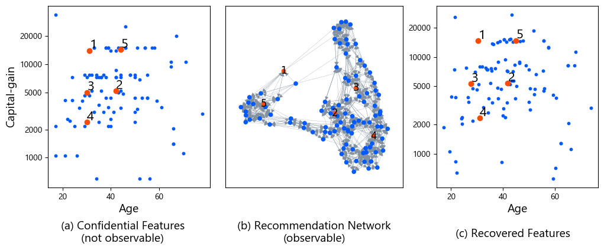
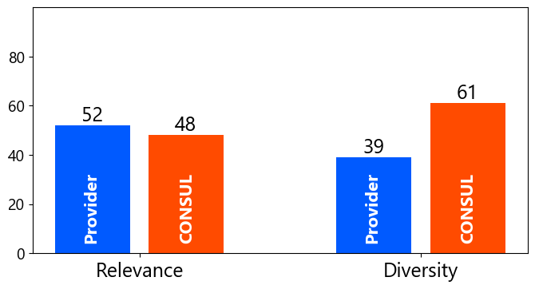

# Towards Principled User-side Recommender Systems (CIKM 2022)

<p align="center">
  
</p>

User-side recommender systems enable each user of web services to build their own recommender system. However, user-side recommender systems face the problem of limited information, and it is not clear whether building user-side recommender systems is a well-defined problem. In this project, we investigate the feasibility of user-side recommender systems from a theoretical aspect and formulate desirable properties that user-side recommender systems should meet. We propose Consul, an algorithm for user-side recommender systems that provably meet the desiderata.

Paper: https://arxiv.org/abs/2208.09864

## Clone this repository

Please be sure to add `--recusrsive` when you clone this repository so that the submodule is downloaded.

```
$ git clone git@github.com:joisino/consul.git --recursive
```

## 💿 Dependency

```
$ pip install -r requirements.txt
$ sudo apt install wget unzip
```

You need to install [docker](https://www.docker.com/) to run the LOF experiment (RQ 1).

## 🗃️ Download and Preprocess Datasets

You can download and preprocess data by the following command. It may take time.

```
$ bash download.sh
```

`hetrec.npy` is the Last.fm dataset. `home_and_kitchen.npy` is the Amazon dataset. `adult_*.npy` and `adult_*.npz` are the Adult dataset.

## 🧪 Experiments

### Feature Reverse Engineering (RQ 1)



The image above can be reproduced by the following command.

```
$ python LOE_adult.py
```

### Performance (RQ 2)

|Method|Adult<br>Accuracy↑|Adult<br>Access↓|MovieLens<br>nDCG↑|MovieLens<br>Recall↑|MovieLens<br>Access↓|MovieLens(pop)<br>nDCG↑|MovieLens(pop)<br>Recall↑|MovieLens(pop)<br>Access↓|Amazon<br>nDCG↑|Amazon<br>Recall↑|Amazon<br>Access↓|LastFM<br>nDCG↑|LastFM<br>Recall↑|LastFM<br>Access↓|
|----|----|----|----|----|----|----|----|----|----|----|----|----|----|----|
|Oracle|**0.788**|∞|**0.0321**|**0.057**|∞|**0.034**|**0.064**|∞|**0.0326**|**0.057**|∞|**0.0652**|**0.111**|∞ |
|PrivateRank|0.781|39190|0.0314|0.055|1682|**0.034**|0.062|1682|0.0325|**0.057**|1171|0.0641|0.107|1507|
|PrivateWalk|0.762|270.5|0.0273|0.049|154.2|0.029|0.054|44.0|0.0217|0.048|135.7|0.0424|0.080|74.1|
|Consul|0.765|**34.5**|**0.0321**|**0.057**|**19.6**|0.033|0.060|**4.6**|0.0310|0.052|**7.3**|0.0639|0.107|**6.5**|

The above table can be reproduced by `evaluate.py` and `evaluate_adult.py`.

```
$ python evaluate.py --data 100k --prov bpr --sensitive popularity
$ python evaluate.py --data 100k --prov bpr --sensitive old
$ python evaluate.py --data hetrec --prov bpr --sensitive popularity
$ python evaluate.py --data home --prov bpr --sensitive popularity
$ python evaluate_adult.py
```

* `100k` is the MovieLens 100k dataset. `hetrec` is the LastFM dataset. `home` is the Amazon Home and Kitchen dataset.
* `--prov` specifies the algorithm of the service provider's recommender system.
* `--sensitive` specifies the sensitive attribute. `old` is available only for the MovieLens datasets.

These scripts compute the sums of recalls, NDCGs, and the least number of items from protected groups. Be sure to divide these values by the number of users to obtain the average values.

When your environment supports multi-processing, run, for example, the following commands to speed up the computation (with background executions):

```
$ python evaluate.py --data 100k --prov bpr --sensitive old --split 7 --block 0
$ python evaluate.py --data 100k --prov bpr --sensitive old --split 7 --block 1
$ python evaluate.py --data 100k --prov bpr --sensitive old --split 7 --block 2
$ python evaluate.py --data 100k --prov bpr --sensitive old --split 7 --block 3
$ python evaluate.py --data 100k --prov bpr --sensitive old --split 7 --block 4
$ python evaluate.py --data 100k --prov bpr --sensitive old --split 7 --block 5
$ python evaluate.py --data 100k --prov bpr --sensitive old --split 7 --block 6
$ python summary.py 7
```

### User Study (RQ 3)

The csv file used in the Amazon Mechanical Turk study is generated by `python user_study.py`.

The crowd workers found that Consul was on par in terms of relevance and superior in terms of diversity.



The following lists are the recommendation results for Terminator 2: Judgment Day (1991). The crowd workers found that Consul was superior in terms of *both* relevance and diversity in this example.

|Provider|Consul|
|---|---|
|Total Recall (1990)|Total Recall (1990)|
|The Matrix (1990)|The Matrix (1990) |
|The Terminator (1990)|The Terminator (1990)|
|Jurassic Park (1993)|Alien (1979)|
|Men in Black (1997)|Star Wars: Episode IV (1977)|
|The Fugitive (1993)|Star Trek: The Motion Picture (1979)|

These results indicate that Consul can retrieve information that the provider recommender systems cannot.

## 🖋️ Citation

```
@inproceedings{sato2022principled,
  author    = {Ryoma Sato},
  title     = {Towards Principled User-side Recommender Systems},
  booktitle = {The 31st {ACM} International Conference on Information
               and Knowledge Management, {CIKM}},
  year      = {2022},
}
```
